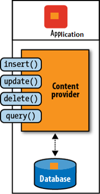
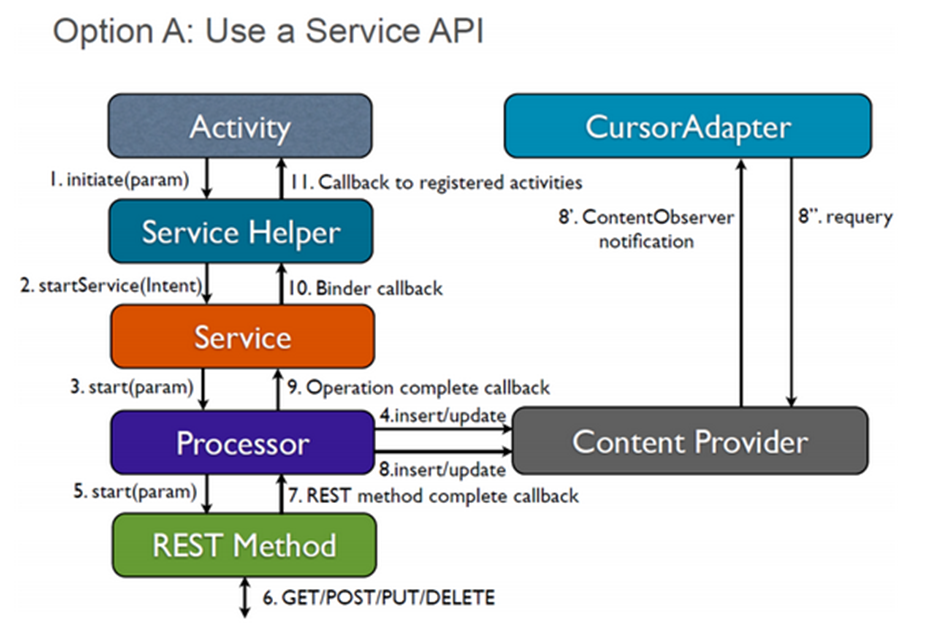
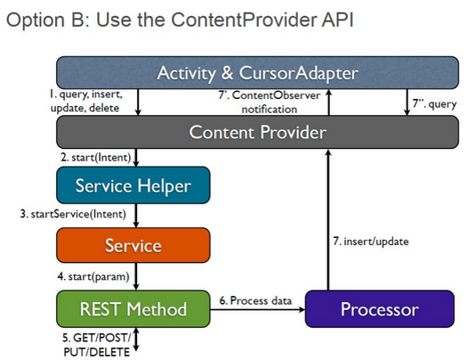
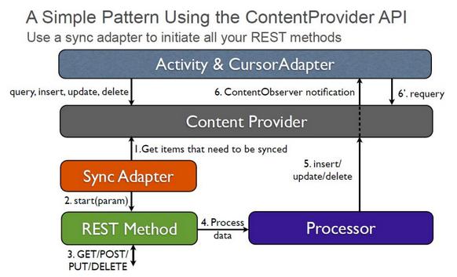

[содержание](../readme.md)

# Архитектура андроид-приложений. Паттерны A/B/C.

## Введение

На [прошлой](../articles/test-intro.md) лекции мы рассмотрели способы обработки пересоздания Activity и проблемы сохранения данных при пересоздании. Но здесь есть и другой фактор – ведь Activity может не пересоздаваться при выполнении запроса, а вообще уничтожиться. А это грозит некоторыми проблемами. Во-первых, у вас может произойти рассинхронизация данных на сервере и клиенте. Клиент выполнит запрос, сервер примет его и вернет результат с новыми данными, которые клиент уже не сможет получить (в связи с тем, что приложение было закрыто). Когда клиент откроет приложение в следующий раз, к примеру, в офлайне, он увидит старую информацию, которую не ожидает увидеть. Во-вторых, возможно, что для завершения операции вам нужно получить один ответ, обработать его и выполнить новый запрос. Бесспорно, что это ужасная ситуация и так делать никогда не нужно, но бэкенды бывают разные, и не всегда они идеальны. В таком случае ситуация еще хуже, так как данные вашего приложения могут зависнуть посередине процесса.

Нужно сразу сказать, что проблемы, описанные выше, не относятся ко всем приложениям. Более того, они не относятся к большинству приложений. Но при этом знать способы решения таких проблем необходимо.

Есть очевидное, но вполне правильное решение таких проблем – использовать для запросов компонент, который не уничтожается системой, даже если пользователь закроет приложение. Благо, что такой компонент есть, и это **Service**.

**Service** (сервис) – это компонент, который предназначен для выполнения определенных операций в фоне и который не содержит никаких UI-элементов. Огромным плюсом сервисов является то, что они продолжат работать даже тогда, когда пользователь закроет все Activity приложения.

Простейшая реализация сервиса выглядит следующим образом:

```java
public class SimpleService extends Service {
 
    @Override
    public int onStartCommand(Intent intent, int flags, int startId) {
        // TODO : do you work here
        // This code runs in the UI thread
        return super.onStartCommand(intent, flags, startId);
    }
 
    @Nullable
    @Override
    public IBinder onBind(Intent intent) {
        return null;
    }
}
```

После этого сервис нужно зарегистрировать в манифесте:

```xml
<service android:name=".network.SimpleService"/>
```

И его можно запустить следующим образом:

```java
@Override
protected void onCreate(Bundle savedInstanceState) {
    super.onCreate(savedInstanceState);
    setContentView(R.layout.activity_weather);
    Intent intent = new Intent(this, SimpleService.class);
    startService(intent);
}
```

Intent, который передается в качестве параметра методу startService, в итоге попадает параметром в метод onStartCommand, где вы можете получить все необходимые переданные параметры.

Метод onBind служит для создания другого типа сервисов, которые в контексте рассматриваемой темы нас не интересует. Можно только сказать, что это позволяет привязать сервис к другому компоненту приложения (к примеру, к Activity) и осуществлять различную фоновую работу, в том числе и между процессами. Но поскольку привязанный сервис умирает вместе с компонентом, к которому он привязан, для решения текущей проблемы он нам никак не поможет. Более подробно о его применениях можно посмотреть в [документации][1].

Несмотря на тот факт, что сервис предназначен для работы в фоне, сам класс **Service** не содержит средств для обеспечения асинхронности выполнения задач, и метод *onStartCommand* работает в главном потоке приложения. Асинхронность должен обеспечить разработчик, воспользовавшись любыми известными ему средствами. Есть и альтернатива – IntentService, который является простой однопоточной реализацией сервиса. К примеру, для загрузки данных и выполнения сетевых запросов IntentService можно использовать следующим образом:

```java
public class NetworkService extends IntentService {
    public NetworkService() {
        super(NetworkService.class.getName());
    }
 
    @Override
    protected void onHandleIntent(Intent intent) {
        try {
            City city = ApiFactory.getWeatherService()
                .getWeather(getString(R.string.default_city))
                .execute()
                .body();
        } catch (IOException ignored) {
        }
    }
}
```

Здесь нужно еще сделать небольшое примечание – IntentService однопоточный и обрабатывает все поступающие к нему запросы последовательно.

Казалось бы, раз сервис такой мощный компонент, который не уничтожается при смене конфигурации или даже при закрытии приложения, почему его не используют для сетевых запросов всегда? И вот здесь мы сталкиваемся с основной проблемой, которая и отвечает на этот вопрос. Обратите еще раз внимание на метод onHandleIntent:

```java
@Override
protected void onHandleIntent(Intent intent) {
    try {
        City city = ApiFactory.getWeatherService()
            .getWeather(getString(R.string.default_city))
            .execute()
            .body();
    } catch (IOException ignored) {
    }
}
```

А именно на то, что этот метод имеет тип void. То есть данные о погоде мы загрузили, но как именно передать эту информацию не совсем понятно. В этом и заключается основная проблема сервисов – так как они никак не связаны с UI-классами, они не могут передать данные в них.

Одно из стандартных решений в таком случае – это использование различных Bus, к примеру, EventBus, Otto или даже шины на RxJava. Но такие способы ненадежны, поскольку работа с Bus требует подписки и отписки в UI-классах согласно методам жизненного цикла. К тому же их использование делает код неочевидным.

К сожалению, для этой проблемы нет простого и хорошего решения. И именно поэтому мы рассмотрим паттерны, которые были представлены на конференции Google I/O в 2010 году.

Для понимания этих паттернов нам понадобится сначала подробнее познакомиться с понятиями REST, а также изучить API ContentProvider, поскольку эти паттерны полностью базируются на них.

## REST

Вероятно, каждый слышал такие слова как REST API, RESTful сервисы и другие смежные понятия. Что под этими понятиями подразумевается? В первую очередь, REST – это не какой-то жестко зафиксированный формат работы с веб-сервисами, а скорее набор принципов, который определяет, как должны взаимодействовать между собой веб-стандарты / компоненты, такие как HTTP, URI, и как они должны использоваться. Эти принципы предназначены для того, чтобы строить архитектуру веб-сервисов.

Из этого набора принципов можно выделить несколько ключевых:

1. Каждая сущность должна иметь уникальный идентификатор – URI.
2. Сущности должны быть связаны между собой.
3. Для чтения и изменения данных должны использоваться стандартные методы.
4. Должна быть поддержка нескольких типов ресурсов.
5. Взаимодействие должно осуществляться без состояния.

Большинство из этих принципов нужно только при реализации веб-сервисов, разумеется. Для разработки клиентской части, в частности для мобильного приложения, нам достаточно 1-ого и 3-ого принципа.

**Принцип 1** говорит о том, что каждый объект должен иметь свой уникальный идентификатор, более того – адрес URI, по которому к нему можно обратиться. URI (от Uniform Resources Identifier) – уникальный идентификатор ресурса. Как мы увидим далее, этот термин широко используется и в Android. Уникальный идентификатор нужен для того, чтобы обращаться к этому объекту и чтобы связывать его с другими объектами.

**Принцип 3** сообщает об использовании стандартных методов для вызова удаленных процедур (и изменения данных). Эти методы хорошо известным всем:

* GET – получение данных без их изменения. Это наиболее популярный и легкий метод. Он только возвращает данные, а не изменяет их, поэтому на клиенте вам не нужно заботиться о том, что вы можете повредить данные.
* POST – метод, подразумевающий вставку новых записей.
* PUT – метод, подразумевающий изменение существующих записей.
* PATCH – метод, подразумевающий изменение идентификатора существующих записей.
* DELETE – метод, подразумевающий удаление записей.

Знание об этих методах очень важно для нашего дальнейшего изучения. И для нас достаточно информации о REST, давайте только упростим его итоговое понимание и дадим свое представление. REST API – это набор удаленных вызовов стандартных методов, возвращающих данные в определенном формате. С таким определением и будем дальше работать.

## ContentProvider

В этой лекции мы также рассмотрим очень удобный способ для работы с данными в Android, а именно ContentProvider. ContentProvider – это класс, предоставляющий унифицированный интерфейс для доступа к данным приложения. Этот класс позволяет вам использовать единый источник данных в вашем приложении.

ContentProvider также позволяет передавать данные между приложениями. К примеру, таким образом осуществляется работа с телефонными контактами, смс и другими системными данными. К большому сожалению, на этот счет в документации есть серьезная ошибка. В документации по ContentProvider сказано, что “You don’t need to develop your own provider if you don’t intend to share your data with other applications.”, то есть мы не должны реализовывать свой ContentProvider, если мы собираемся использовать его только внутри своего приложения. Такая ошибка стоит дорого, многие разработчики после прочтения верят в то, что ContentProvider им никогда не понадобится, а это не так. Так какие же преимущества есть у этого класса, и зачем он может нам понадобиться?

**Во-первых**, как уже было сказано, ContentProvider предоставляет унифицированный интерфейс для доступа к данным. Унифицированный здесь подразумевает как независящий от реализации (а это очень вам поможет в случаях, когда вы решите изменить реализацию своего хранилища), так и покрывающий все необходимые случаи.

**Во-вторых**, вам не нужно управлять жизненным циклом объекта для доступа к данным (к примеру, экземпляра SQLiteDatabase). Ведь в случае прямого использования таких объектов возникает немало вопросов: где хранить этот объект? Когда закрывать базу данных? Когда уничтожать этот объект? ContentProvider позволяет вам не беспокоиться о таких вещах. К тому же он позволяет получать доступ к данным из любого места, где доступен контекст приложения (экземпляр Context).

И **в-третьих**, ContentProvider полностью соответствует концепциям REST, которые мы рассмотрели. Это хорошо тем, что позволяет использовать его для наших целей (ContentProvider может выступать в роли фасада для запросов к серверу), и это будет подробнее рассмотрено далее. А пока перейдем к работе с ContentProvider.



Поскольку ContentProvider соответствует принципам REST, то для каждой сущности у него есть свой URI. У ContentProvider есть базовый URI, который определяется создателем приложения и регистрируется в манифесте. Это выглядит примерно следующим образом:

```xml
<provider
    android:name=".data.sqlite.WeatherContentProvider"
    android:authorities="ru.gdgkazan.simpleweather"
    android:exported="false"/>
```   

Для обращения к данным через ContentProvider нам требуется URI для этих данных (по URI можно обращаться как к группе данных, так и к отдельному объекту). У ContentProvider приложения всегда определен базовый URI, который формируется из authorities в манифесте и префикса content://. Поэтому в нашем случае базовый URI будет такого вида:

```
content://ru.gdgkazan.simpleweather
```

Если мы обратимся к данным в ContentProvider по этому URI, то получим все экземпляры, сохраненные в этой группе.

И наконец, если нам нужно URI для отдельного объекта, то оно будет выглядеть следующим образом:

```
content://ru.gdgkazan.simpleweather/weather/4
```

Где 4 – это номер добавленного экземпляра.

Работа с URI очень важна. API ContentProvider позволяет следить за изменениями в данных по конкретному URI, что чрезвычайно удобно, так как позволяет легко организовать автоматическое обновление данных в UI-классах.

Но в общем здесь нет ничего сложного и нового, это стандартные средства формирования URI (а на самом деле URL – это частный случай URI, так что такой принцип всем прекрасно знаком). Поэтому закончим с URI и перейдем к реализации своего ContentProvider.

>Примечание: в дальнейшем в рамках этой лекции мы будем работать со специальной библиотекой, которая основана на ContentProvider, поддерживает табличную модель и позволяет выполнять все нужные функции, в том числе подписываться на уведомления об изменениях в таблице. Это скрывает некоторые излишние детали реализации, позволяя целиком сосредоточиться на сути лекции. Описание и код библиотеки доступны по ссылке выше. Все примеры далее будут основаны на этой библиотеке.

Для реализации своего ContentProvider нужно создать класс, который будет наследоваться от ContentProvider и переопределить все требуемые методы. Рассмотрим эти методы по порядку. Во-первых, это метод onCreate, в котором нужно инициализировать все поля, которые потребуются для работы:

```java
@Override
public final boolean onCreate() {
   SQLiteConfig config = new SQLiteConfig(getContext());
   prepareConfig(config);

   sContentAuthority = config.getAuthority();
   sBaseUri = Uri.parse("content://" + sContentAuthority);
 
   mSchema = new SQLiteSchema();
   prepareSchema(mSchema);
 
   mSQLiteHelper = new SQLiteHelper(getContext(), config, mSchema);
   return true;
}
```

Что делает код в этом методе? Во-первых, он создает базовый URI для дальнейшего обращения к данным в ContentProvider. Во-вторых, он создает схему данных в ContentProvider (в простейшем случае – добавляет таблицы в базу данных). И наконец, в этом методе создается экземпляр SQLiteOpenHelper, через который и будет организован доступ к хранилищу данных.

Следующим методом является метод getType. Этот метод должен вернуть тип данных, который содержится по переданному в качестве параметра URI. Обычно этот метод используют для сопоставления имени таблицы и URI, чтобы потом выполнить запрос к базе данных. В нашем случае реализация внешне выглядит просто, а углубляться мы не будем (это всегда можно сделать, посмотрев код библиотеки):

```java
@Nullable
@Override
public final String getType(@NonNull Uri uri) {
   return mSchema.findTable(uri);
}
```

И далее начинаются методы, которые непосредственно предназначены для работы с данными. Это методы, которые полностью соответствуют HTTP методам, что мы и будем использовать в дальнейшем. А пока посмотрим реализацию этих методов. В большинстве случаев эти методы только переадресовывают вызов базе данных SQLite. В первую очередь это метод query (который соответствует HTTP методу GET):

```java
@Nullable
@Override
public final Cursor query(@NonNull Uri uri,
                         String[] projection,
                         String selection,
                         String[] selectionArgs,
                         String sortOrder) {
   SQLiteDatabase database = mSQLiteHelper.getWritableDatabase();
   String table = getType(uri);
   if (TextUtils.isEmpty(table)) {
       throw new IllegalArgumentException("No such table to query");
   } else {
       return database.query(table,
               projection,
               selection,
               selectionArgs,
               null,
               null,
               sortOrder);
   }
}
```

Этот метод в начале проверяет, существует ли вызываемая таблица, и, если да, то вызывает метод query у объекта SQLiteDatabase, который на основании всех параметров строит SQL-запрос и возвращает данные.

Следующим идет метод insert, предназначенный для добавления элемента в ContentProvider и соответствующий HTTP методу POST:

```java
@NonNull
@Override
public final Uri insert(@NonNull Uri uri, ContentValues values) {
   SQLiteDatabase database = mSQLiteHelper.getWritableDatabase();
   String table = getType(uri);
   if (TextUtils.isEmpty(table)) {
       throw new IllegalArgumentException("No such table to insert");
   } else {
       long id = database.insertWithOnConflict(table, null, values, SQLiteDatabase.CONFLICT_REPLACE);
       return ContentUris.withAppendedId(uri, id);
   }
}
```

Обратите внимание на следующий вызов:

```java
return ContentUris.withAppendedId(uri, id);
```

База данных SQLite ничего не знает о таких штуках как URI, она привыкла работать с идентификаторами в другом виде, к примеру, в виде id. К счастью, встроенные средства Android позволяют с легкостью объединить использование ContentProvider и SQLite.

Следующим необходимым для переопределения методом является метод delete и служащий для удаления данных из ContentProvider. И, кстати говоря, это единственный метод ContentProvider, HTTP аналог которого имеет такое же название. Реализация этого метода аналогична всем остальным:

```java
@Override
public final int delete(@NonNull Uri uri, String selection, String[] selectionArgs) {
   SQLiteDatabase database = mSQLiteHelper.getWritableDatabase();
   String table = getType(uri);
   if (TextUtils.isEmpty(table)) {
       throw new IllegalArgumentException("No such table to delete");
   } else {
       return database.delete(table, selection, selectionArgs);
   }
}
```

И последний метод, который нужно переопределить для реализации ContentProvider, это метод update (в терминологии HTTP методов – PUT или PATCH):

```java
@Override
public final int update(@NonNull Uri uri, ContentValues values,
                 String selection, String[] selectionArgs) {
   SQLiteDatabase database = mSQLiteHelper.getWritableDatabase();
   String table = getType(uri);
   if (TextUtils.isEmpty(table)) {
       throw new IllegalArgumentException("No such table to update");
   } else {
       return database.update(table, values, selection, selectionArgs);
   }
}
```

Кроме этих методов, достаточно часто переопределяется и метод bulkInsert (который в отличие от предыдущих методов не является обязательным к реализации). Этот метод предназначен для вставки массива элементов, и его реализация по умолчанию вызывает метод insert для каждого элемента, что неэффективно. Поэтому этот метод обычно переопределяют так, чтобы выполнить все вставки в рамках одной транзакции:

```java
@Override
public final int bulkInsert(@NonNull Uri uri, @NonNull ContentValues[] values) {
   SQLiteDatabase database = mSQLiteHelper.getWritableDatabase();
   String table = getType(uri);
   if (TextUtils.isEmpty(table)) {
       throw new IllegalArgumentException("No such table to insert");
   } else {
       int numInserted = 0;
       database.beginTransaction();
       try {
           for (ContentValues contentValues : values) {
               long id = database.insertWithOnConflict(table, null, contentValues, SQLiteDatabase.CONFLICT_REPLACE);
               if (id > 0) {
                   numInserted++;
               }
           }
           database.setTransactionSuccessful();
       } finally {
           database.endTransaction();
       }
       return numInserted;
   }
}
```

Вот и все! Мы создали свой ContentProvider, добавили его в манифесте и теперь можем обращаться к нему в качестве интерфейса для работы с данными. Здесь есть небольшая тонкость – мы создавали объект ContentProvider, но обращаться к данным нужно через объект ContentResolver, который можно получить через метод getContentResolver в класс Context:

```java
Cursor cursor = mContext.getContentResolver().query(table.getUri(), null, where.where(), where.whereArgs(), where.limit());
```

Нельзя не сказать и следующее замечание. Большинство современных библиотек для работы с базой данных предоставляют вам намного более удобный интерфейс для работы, нежели SQL-запросы к базе. При этом они либо скрывают под своей реализацией работу с ContentProvider, либо напрямую работают с экземплярами баз данных (и в таком случае они наверняка не поддерживают уведомления об изменение таблиц или тем более конкретных записей). Поэтому глубоко изучать принципы работы ContentProvider нам сейчас не нужно, а хватит такого понимания связи ContentProvider и REST архитектуры и принципов работы основных методов.

## Паттерны A/B/C

После предыдущего раздела стало понятно, как связаны принципы REST и ContentProvider между собой, осталось только понять, каким образом они применяются к нашей задаче.

Идея очень простая – посредником между сервисом и UI-классами выступит ContentProvider, так как его идеология и методы полностью совпадают с архитектурой REST. Доступ к данным в ContentProvider можно получить из любого места, где доступен контекст приложения, то есть и из сервиса, и из UI-классов. А вместе с возможностью отслеживать изменения конкретных сущностей или таблиц по URI ContentProvider позволяет обеспечить невероятно качественный и удобный (по сравнению с другими способами взаимодействия между сервисами и UI-классами) уровень взаимодействия этих компонентов.



В общем виде архитектуру паттерна A можно описать следующей последовательностью действий:

1. UI-класс запускает сервис для выполнения запроса и подписывается на изменение данных в таблице.
2. Сервис выполняет запрос, сохраняет данные в базу и уведомляет об изменении таблицы.
3. UI-класс получает уведомление об изменение данных в таблице, считывает новые данные и отображает их пользователю.

Эту последовательность действий можно представить в виде следующей диаграммы:

При этом есть немало промежуточных действий, о которых будет сказано далее. А пока давайте реализуем такой простейший подход. В первую очередь модифицируем сервис для загрузки данных, чтобы он сохранял данные в базу и уведомлял подписчиков об этом:

```java
@Override
protected void onHandleIntent(Intent intent) {
   SQLite.get().delete(CityTable.TABLE);
 
   try {
       City city = ApiFactory.getWeatherService()
               .getWeather(getString(R.string.default_city))
               .execute()
               .body();
       SQLite.get().insert(CityTable.TABLE, city);
   } catch (IOException ignored) {
   } finally {
       SQLite.get().notifyTableChanged(CityTable.TABLE);
   }
}
```

Теперь остается запустить этот сервис в любом UI-классе и подписаться на изменения в таблице:

```java 
private void loadWeather() {
   mLoadingView.showLoadingIndicator();
   SQLite.get().registerObserver(CityTable.TABLE, this);
   startService(new Intent(this, NetworkService.class));
}
```

Когда сервис загрузит данные, подписавшийся класс получит уведомление об этом, которое сможет обработать:

```java
@Override
public void onTableChanged(@NonNull List<City> cities) {
   if (cities.isEmpty()) {
       mCity = null;
       showError();
   } else {
       mCity = cities.get(0);
       showWeather();
   }
   mLoadingView.hideLoadingIndicator();
   SQLite.get().unregisterObserver(this);
}
```

Такое решение не выглядит особо сложным, но на деле и здесь приходится решать немало вопросов и проблем. **Во-первых**, мы должны корректно обрабатывать различные события жизненного цикла и отписываться от уведомлений. То есть здесь мы не ушли от проблем, которые рассматривались в рамках [предыдущей лекции](/articles/test-intro.md). Конечно, эти проблемы можно решать теми же средствами, но хотелось бы, чтобы этих проблем не было вообще.

**Во-вторых**, нужно уметь обрабатывать ошибки. В примере выше мы смотрели, если нет записей в базе данных, значит, произошла ошибка. Разумеется, в любом более серьезном примере такой вариант не подойдет.

И **в-третьих**, а точнее, развивая второй пункт, нам нужно уметь отслеживать статус каждого запроса, чтобы показывать процесс загрузки и скрывать его, а также, чтобы повторно не запускать уже выполняющийся запрос.

Именно поэтому пример выше является наивной и простейшей реализацией паттерна A. На самом деле в оригинальном изложении паттерна все сложнее, но этот пример нужен был для того, чтобы показать, зачем нужны эти сложности.

В первую очередь мы должны завести класс, который будет отвечать за статус и информацию о каждом запросе. Это позволит нам, и отслеживать статус, и обрабатывать ошибки. Этот класс должен содержать идентификатор запроса, статус запроса и тело ошибки (которое будет пустым в случае успешного запроса):

```java
public class Request {
 
   @NetworkRequest
   private final String mRequest;
 
   private RequestStatus mStatus;
 
   private String mError;
 
   public Request(@NonNull @NetworkRequest String request,
                  @NonNull RequestStatus status,
                  @NonNull String error) {
       mRequest = request;
       mStatus = status;
       mError = error;
   }
}
```

Создадим таблицу для этого класса. После этого в UI-классах всегда будем подписываться на изменения именно этой таблицы со статусом (в идеале, конечно, это должна быть подписка на отдельный элемент, но это сложнее реализовать).

После этого переработаем сервис для запросов следующим образом (в связи с тем, что код значительно увеличился, будем приводить его по частям):

```java
@Override
protected void onHandleIntent(Intent intent) {
   Request request = SQLite.get().querySingle(RequestTable.TABLE);
   if (request != null && request.getStatus() == RequestStatus.IN_PROGRESS) {
       return;
   }
   if (request == null) {
       request = new Request(NetworkRequest.CITY_WEATHER, RequestStatus.IN_PROGRESS, "");
   } else {
       request.setStatus(RequestStatus.IN_PROGRESS);
   }
   SQLite.get().insert(RequestTable.TABLE, request);
   SQLite.get().notifyTableChanged(RequestTable.TABLE);
   //...
}
```

Вначале мы получаем текущую запись о запросе информации о погоде. Если этот запрос находится в статусе IN_PROGRESS, то есть уже в процессе выполнения, то мы игнорируем этот новый вызов.

После этого мы переводим запрос в статус IN_PROGRESS и уведомляем подписчиков (это нужно для того, чтобы UI-классы могли отобразить процесс загрузки).

Продолжим рассмотрение метода:

```java
//...
try {
   City city = ApiFactory.getWeatherService()
           .getWeather(getString(R.string.default_city))
           .execute()
           .body();
   SQLite.get().delete(CityTable.TABLE);
   SQLite.get().insert(CityTable.TABLE, city);
   request.setStatus(RequestStatus.SUCCESS);
} catch (IOException e) {
   request.setStatus(RequestStatus.ERROR);
   request.setError(e.getMessage());
} finally {
   SQLite.get().insert(RequestTable.TABLE, request);
   SQLite.get().notifyTableChanged(RequestTable.TABLE);
}
```

Здесь все просто. Мы получаем результат с сервера, сохраняем их в базе данных и в зависимости от успеха / неудачи при получении данных переводим статус либо в SUCCESS, либо в ERROR. И уведомляем подписчиков о завершении запроса.

UI-часть может обрабатывать эти уведомления следующим образом (здесь используются средства RxJava для обеспечения асинхронности при работе с базой данных. RxJava будет рассматриваться в следующей лекции, а пока код детально прокомментируем):

При получении уведомления об изменении данных в таблице, мы считываем статус запроса из базы. После этого мы выбираем действия в зависимости от этого статуса:

* Если статус IN_PROGRESS, то показываем процесс загрузки
* Если статус ERROR, то полученная ошибка прокидывается дальше и отображается.
* Если статус SUCCESS, то мы считываем информацию о городе и передаем ее подписчику, который покажет эту информацию.

Таким образом, мы можем отслеживать изменения в статусе запроса и корректно реагировать на эти изменения. Конечно, как уже говорилось, идеально будет отслеживать не все таблицу с запросами, а каждый запрос отдельно.

Но нам все еще нужно постараться обрабатывать события жизненного цикла, чтобы не перезапускать сервис каждый раз при пересоздании Activity. Для этого можно использовать различные подходы, рассмотренные в первой лекции, к примеру, лоадеры.

Подводя промежуточный итог, можно сказать, что паттерн A имеет 2 главных преимущества:

* Гарантированное выполнение всех запросов независимо от жизненного цикла UI-классов.
* Поддержка единого источника данных в приложении.

Но у него, разумеется, есть и проблемы, однако все из них можно решить. Правда, это может сильно усложнить архитектуру приложения.

## Паттерн B



У *паттерна A*, который мы рассмотрели, разумеется, есть и недостатки. Это и большое количество кода, и необходимость использовать работу с данными на основе ContentProvider, и задача обработки жизненного цикла, и другие. Поэтому предлагаются и другие варианты реализации клиент-серверного взаимодействия, которые лишены части этих недостатков (хотя откровенно говоря, они обладают другими недостатками).

*Паттерн B* в плане идейных блоков очень похож на паттерн A, в нем точно также используются Service и ContentProvider, но вот порядок их использования диаметрально противоположен. Если в паттерне A ContentProvider использовался как вспомогательный слой для взаимодействия между сервисом, выполняющим сетевые запросы, и UI-классами, то в паттерне B UI-классы работают исключительно и всегда с API ContentProvider. И уже другие классы синхронизируют данные из ContentProvider с данными с сервера. Поэтому для данного паттерна API ContentProvider является в общем случае локальной версией серверной части со всеми вытекающими последствиями.

Схема паттерна B выглядит следующим образом:

В этом паттерне есть невероятно существенный плюс – вся работа с “сетью” осуществляется локально, а это дает нам уверенность, что любой запрос выполнится если не мгновенно, то очень быстро. Поэтому мы избавляемся от долгих операций и ожидания, а также от многих проблем при обработке жизненного цикла. Кроме того, наше приложение будет работать безо всяких задержек, что создаст очень хорошее впечатление у пользователя.

Но за все приходится платить. И понятно, что за такой серьезный плюс платить придется также очень серьезно. В чем это заключается? **Во-первых**, вы всегда будете рисковать получить ситуацию, когда ваши локальные данные не синхронизированы с данными на сервере, а это значит, что операции, которые совершал пользователь, могут быть отменены, а пользователь даже не поймет причины.

**Во-вторых**, чтобы хоть как-то обезопасить себя от слишком частых ошибок на стороне сервера, нужно перенести хотя бы часть серверной логики в приложение. А это как минимум означает дублирование кода и логики (двойная возможность ошибиться), да и в большинстве случаев серверная часть – это огромная система, которую крайне нерационально переносить на клиентскую сторону.

К сожалению, нужно признать, что такой паттерн в связи со своими минусами обладает слишком большими недостатками, чтобы применять его на практике. Исключениями могут быть ситуации, когда у вас небольшое и простое приложение без сложной серверной логики и когда вы можете быть уверены, что всей логики на стороне клиента будет достаточно. Такие случаи редки, но в них паттерн B будет давать ощутимый выигрыш в скорости работы приложения, так что его надо иметь в виду.

## Паттерн С



И последний рассматриваемый паттерн – это *паттерн C*, который по факту является модификацией предыдущего паттерна и очень на него похож. Вся разница заключается в том, что для синхронизации используется не сервис, а класс SyncAdapter. Как можно догадаться из названия, SyncAdapter предназначен для синхронизации данных. Он имеет ряд преимуществ перед сервисами:

* *Экономия заряда батареи*. Когда пользователь запускает приложение, вы начинаете дергать запросы в сеть, система вынуждена использовать радиомодуль на полную мощность, что увеличивает расход батареи. При использовании SyncAdapter система сама запускает синхронизацию в удобный для себя момент. Кратко говоря, система с определенной периодичностью включает радиомодуль и синхронизирует данные во всех приложениях, которые используют SyncAdapter. Это намного эффективнее в плане расхода заряда батареи, чем если бы каждое приложение само решало, когда нужно использовать сеть.
* *Контроль за состоянием*. Это подразумевает как контроль за состоянием сети и автоматическую синхронизацию при появлении интернета, так и повторную синхронизацию, если не удалось синхронизировать данные в прошлый раз.
* *Планирование синхронизации*. Можно настроить параметры и расписание для синхронизации, которые будут учтены системным планировщиком.
* *Свой аккаунт* для приложения и возможность для пользователя синхронизировать данные вручную в системных настройках приложения.

SyncAdapter – это удобный способ для синхронизации данных. Но его не так часто используют по нескольким причинам:

* Не всем приложениям нужна периодическая синхронизация данных. Более того, она не нужна подавляющему большинству приложений. Большинство приложений работают, если можно так выразиться, в сеансовом режиме, то есть обновляют данные и шлют запросы к серверу только во время активной работы. А вместе с пуш-сообщениями, модель данных без синхронизации покрывает требования очень большого числа приложений. Исключениями могут быть, к примеру, приложения для работы с финансами или погодные приложения.
* Неудобное взаимодействие с данными. К сожалению, это так. Обновление данных через SyncAdapter с последующим чтением их из ContentProvider требует гораздо больше усилий, чем прямое обновление данных в UI-классах.

Реализация своего SyncAdapter не представляет сложностей, поэтому мы опустим рассмотрение этой темы. Подробную информацию можно найти по ссылкам в конце лекции.

Конкретная реализация каждого из рассмотренных паттернов очень сильно зависит от приложения, которое вы разрабатываете. Главное, чтобы вы понимали основную идею при организации такого способа клиент-серверного взаимодействия, ведь в таком случае вам будет несложно доработать эти паттерны для своего приложения.

[содержание](../readme.md)

[1]: https://developer.android.com/guide/components/bound-services.html "Привязанные службы"