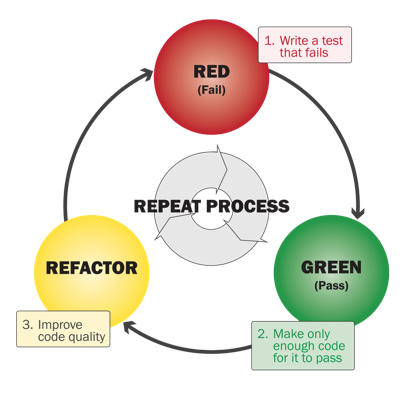

[содержание](../readme.md)

# Unit тестирование. Mockito. Test Driven Development

>Основано на [этой][1] лекции.

В этой лекции мы поговорим о Unit-тестировании. Узнаем, как тестировать андроид-приложения, как работать с библиотекой Mokito, как измерить уровень покрытия тестами в вашем проекте. Отдельно рассмотрим такой подход к рахзработке, как Test Driven Development.

**Содержание:**

1. [Введение](#Введение)
2. Unit-тестирование
    * [JUnit](#JUnit)
    * [Mockito](#Mockito)
    * [Unit-тестирование с классами Android](#Unit-тестирование-с-классами-Android)
    * [Unit-тестирование с серверными запросами](#Unit-тестирование-с-серверными-запросами)
    * [Dependency Injection](#Dependency-Injection)
    * [Измерение покрытия кода тестами](#Измерение-покрытия-кода-тестами)
3. [Дополнительно– Test Driven Development (TDD)](#Test-Driven-Development-TDD)

## Введение

На сегодняшний день тестирование систем является неотъемлемой частью процесса их разработки, и, разумеется, приложения под Android не стали исключением. Тестирование систем позволяет приобрести определенную уверенность в корректности и качестве их работы. Кроме того, тестирование позволяет проще вносить изменения (после внесения изменений систему можно протестировать и убедиться, что она работает корректно).

Существует немало видов тестирования, но для начала нас интересует разделение тестирования по степени автоматизации. Здесь можно очень грубо разделить тестирование на автоматизированное и ручное. Ручное тестирование подразумевает проверку системы человеком, сверку с техническим заданием и требованиями и поиск несоответствий и багов. Автоматическое тестирование позволяет выполнять тестирование системы программно.

Разумеется, у обоих этих способов есть свои преимущества и свои недостатки. Ручное тестирование позволяет лучше выявить недостатки, в том числе и такие проблемы, которые сложно найти с помощью автоматизированного тестирования (к примеру, с помощью автоматизированного тестирования будет тяжело заметить неправильный шрифт или неправильное расположение элементов).

С другой стороны, ручное тестирование в тысячи раз медленнее автоматического. В среднем, за рабочий день тестировщик может полностью проверить работу достаточно небольшого приложения за один день на одном устройстве, в то время как автоматическое тестирование позволяет буквально за несколько минут проверить корректность работы приложения на большом количестве устройств (или мгновенно выполнить тесты для бизнес-логики на JUnit).

Поскольку каждый вид тестирования имеет свои преимущества, правильным решением, будет их совместное использование.

Но нас, разумеется, будет интересовать только автоматическое тестирование, которое позволяет разработчику самостоятельно протестировать свое приложение. Кроме того, написание тестов при разработке имеет еще несколько очень важных преимуществ:

1. Если вы хотите писать тесты, то вам придется придерживаться определенного архитектурного стиля. Мы обсуждали это уже не раз, и именно возможность тестирования была одной из основных причин, из-за которой мы занимались изучением архитектуры приложений.
2. Написание тестов позволяет еще на этапе разработки выявить некоторые проблемы и случайные ошибки в вашем коде.
3. Если в вашем проекте есть автоматические тесты, вы можете с меньшим риском вносить изменения в различные участки кода, поскольку с помощью тестов вы можете быстро проверить, что новыми изменениями вы не сломали старое поведение (конечно, тесты дают не гарантию корректности кода, а только лишь некоторую уверенность в этом, что тоже хорошо).
4. Наличие тестов позволяет контролировать процесс разработки: тесты можно поставить на CI-сервер, чтобы отслеживать текущее состояние кода или проверять рабочие ветки, что очень удобно и дает гарантию того, что в production (релиз) попадет только код с выполняющимися тестами.
5. Автоматические тесты могут служить документацией к вашему коду.

Кроме того, существует немало других разделений по видам тестирования. Один из наиболее употребляемых и важных разделений тестирования – это разделение тестирования по степени их модульности. Здесь в общем случае выделяется 3 вида тестирования:

1. **Модульное** тестирование – это тестирование отдельных модулей системы в независимом от других модулей окружении. Это, вероятно, наиболее популярный и известный вид тестирования, и это логично. Чем более детальное тестирование мы выполняем, тем легче найти потенциальные ошибки, так как в тестировании одного модуля мы проверяем корректность работы только этого модуля, а он, конечно, имеет намного меньшую сложность, чем вся система в целом. Именно для реализации модульного тестирования мы и создавали гибкую и удобную архитектуру с разбиением приложения на слои и отдельные модули.
2. **Интеграционное** тестирование – после проверки корректности работы отдельных модулей нужно проверить, как эти модули взаимодействуют между собой. Потому что система – это не только набор отдельных модулей, но и правила и средства их взаимодействия. Каждый модуль в отдельности может работать правильно, но при этом объединение нескольких модулей может содержать ошибки. Это тестирование выполняется уже на более высоком уровне.
3. **Системное** тестирование – после объединения всех модулей приложения в единую систему и проведения интеграционного тестирования для различных групп модулей нужно провести тестирование того, как система работает в целом и насколько она соответствует изначальным требованиям. Это тестирование на глобальном уровне, поэтому детали реализации отдельных модулей уже не играют роли – система проверяется больше с точки зрения пользователя, или по методу черного ящика.

В рамках системы Android можно выполнять автоматизированное тестирование всех видов, изложенных выше. Но есть и особенности. Во-первых, в рамках нашей архитектуры основным компонентом, который содержит бизнес-логику и который должен быть протестирован в первую очередь, является делегат или Presenter. Presenter – это обычный Java-класс (с возможными зависимостями от Android), поэтому тесты для него пишутся в рамках модульного тестирования и с помощью стандартного фреймворка JUnit. Также в рамках модульного тестирования нужно протестировать работу слоя данных.

В случае модульного тестирования все достаточно очевидно. Но что же насчет интеграционного и системного тестирования? Что является интеграцией нескольких модулей в случае Android-приложения? Обычно под интеграцией нескольких модулей понимается конкретный экран приложения, на котором объединяются модули, содержащие бизнес-логику, и модули из слоя данных. Конкретный экран уже должен быть протестирован с точки зрения пользователя, хоть и с небольшими знаниями о том, как устроена система внутри.

И насчет системного тестирования также все очевидно – это тестирование всего приложения и всех его экранов. Оно также выполняется с точки зрения пользователя.

Тестирование слоя данных, а также интеграционное и системное тестирование в Android реализуются с помощью специальных средств, которые будут рассмотрены в рамках следующей лекции. А сейчас мы перейдем к тестированию бизнес-логики приложения, а именно к тестированию Presenter-ов.

## Unit-тестирование

### JUnit

Мы много раз сказали о тестировании, а также о разных средствах для написания тестов. Но что же такое тесты? Интуитивно мы понимаем, что это означает. Тесты – это некоторые проверки или утверждения, которые позволяют в определенной степени убедиться в корректности работы системы.

Для модульного тестирования Java-кода используется фреймворк JUnit. Этот фреймворк позволяет конфигурировать окружение для тестов, исполнять код, который будет проверять работу некоторых классов, и выводить результаты тестов (сколько успешных тестов, сколько ошибок, и где именно произошли ошибки).

Разберем простейший пример написания тестов. Допустим, у нас есть класс, в котором определен только один метод для сложения двух чисел:

```kt
class MyCalc {
    fun Sum(a: Int, b: Int): Int = a+b
}
```

И напишем для него тестовый класс:

```kt
@RunWith(JUnit4.class)
class MyCalcTest {
    lateinit val calc: MyCalc

    @Before
    fun setUp(){
        // создаем экземпляр класса
        calc = MyCalc()
    }

    @Test
    fun sum() {
        // тестируем результат функции
        Assert.assertEquals(calc.Sum(2,2), 4)
    }

    @After
    fun tearDown(){
        //
    }
}
```

Какие основные элементы есть в этом тесте? *Во-первых*, в аннотации @RunWith указывается так называемый Runner, который и отвечает за запуск тестов, корректный вызов и обработку всех методов (но вроде работает и без него).

*Во-вторых*, мы указываем тестовые методы. Тестовые методы – это методы с аннотацией @Test, в которых выполняется непосредственная проверка тестируемого кода. Большинство проверок выполняется с помощью методов, начинающихся с assert: assertTrue, assertEquals и другие. Эти методы проверяют, соответствует ли результат работы (в нашем примере сложение чисел 2 и 2) ожидаемому значению (в нашем примере это число 4). В случае ошибки выбрасывается исключение, и JUnit информирует нас о том, что какой-то тест не выполняется.

И еще два важных метода – это методы, помеченные аннотациями @Before и @After. Код метода с аннотацией @Before будет выполняться перед выполнением каждого тестового метода. Соответственно, код с аннотацией @After будет выполняться после каждого тестового метода. Эти методы нужны для того, чтобы подготовить какие-то параметры или объекты к тестам (например, вынести тестируемый объект в поле класса и инициализировать его в методе setUp вместо того, чтобы выполнять инициализацию в каждом тестовом методе) или же очистить ресурсы после окончания тестового метода.

Фреймворк JUnit очень простой, и писать тесты на нем легко. По сути, все, что есть в этом примере, и есть основные возможности JUnit. Поэтому мы сразу перейдем к тестированию Presenter-а, который мы создавали в рамках прошлой лекции.

Начнем с простого, проверим, что Presenter корректно создается и инициализируется. Напомним, какие поля определены в этом Presenter-е:

```kt
class AuthPresenter(private val authView: AuthView){
...
```

Получается, что нам нужно создать экземпляр объекта, который реализует интерфейс AuthView. Создадим этот объект, реализовав все его методы и ничего в них не выполняя:

```kt
var mPresenter = object : AuthView {
    override fun successLogin() {}
    override fun showLoginError(error: String) {}
    override fun showPasswordError(error: String) {}
    override fun showLoading() {}
    override fun hideLoading() {}
    override fun getToken(): String  = ""
    override fun setToken(token: String) {}
}
```

И мы наконец-то можем проверить, что наш Presenter корректно создается и инициализируется:

```kt
@Test
fun testCreated(){
    val presenter = AuthPresenter(mPresenter)
    assertNotNull(presenter)
}
```

>При запуске теста может возникнуть ошибка: ``java.lang.RuntimeException: Method isEmpty in android.text.TextUtils not mocked.`` Это происходит из-за того, что класс TextUtils входит в библиотеку Андроид, про которую JVM пока не знает. Пока можно в build.graddle в секцию android добавить заглушку, подробнее эта тема будет затронута ниже:
>```
>testOptions {
>    unitTests.returnDefaultValues = true
>}
>```    

Казалось бы, это самый простой тест, но для его написания мы потратили очень много кода. Можно надеяться, что дальше все пойдет проще. Теперь протестируем метод, который вызывается при старте приложения (напомним, этот метод проверяет текущее состояние авторизации и, если пользователь уже авторизован, то открывает главный экран). Этот метод выглядит следующим образом:

```kt
init {
    val token = authView.getToken()
    if(token.trim()!="")
        authView.successLogin()
}
```

Для этого метода возможно в общем случае два сценария, которые нужно протестировать: когда отсутствует сохраненный токен – тогда Presenter не должен вызывать никакие методы у View, и когда в приложении есть сохраненный токен, тогда Presenter должен вызвать метод successLogin у View.

И вот здесь серьезная проблема. В первом примере мы показывали, как проверить работу метода, который возвращает какой-то результат. Но как проверить void метод? Или еще хуже, как проверить то, что у какого-то объекта не был вызван ни один метод? Конечно, мы можем для каждого тестового метода писать свою реализацию AuthView, которая проверяла бы то, что был вызван определенный метод. Поэтому можно было бы написать примерно такой код (мне его лениво переводить на котлин, в принципе и так понятно):

```java
public class TestAuthView implements AuthView {
 
   private final boolean mExpectRepositories;
   private final boolean mExpectLoginError;
 
 
   public TestAuthView(boolean expectRepositories, boolean expectLoginError) {
       mExpectRepositories = expectRepositories;
       mExpectLoginError = expectLoginError;
   }
 
   @Override
   public void successLogin() {
       assertTrue(mExpectRepositories);
   }
 
   @Override
   public void showLoginError() {
       assertTrue(mExpectLoginError);
   }
}
```

Тогда эту реализацию можно было бы использовать следующим образом:

```java
@Test
public void testEmptyLogin() throws Exception {
   AuthView authView = new TestAuthView(false, true);
   AuthPresenter presenter = new AuthPresenter(mLifecycleHandler, authView);
   presenter.tryLogIn("", "123456");
}
```

При создании TestAuthView мы ожидаем, что для данного теста не будет вызван метод successLogin, зато будет вызван метод showLoginError. И такой подход может работать.

Но теперь мы можем усложнить пример. Допустим, нам нужно проверить, что какой-то метод был вызван несколько раз. Да, мы можем ввести специальные счетчики для каждого метода и вспомогательные классы для проверки этих счетчиков, но это становится уже слишком сложно. А ведь мы так же хотели бы проверять, правильные ли параметры были переданы вызванному методу.

Есть и другой пример, который наверняка отобьет желание реализовывать предложенный подход. Предположим, что для каких-то целей нам потребовалось передать объект Context в Presenter. И, если мы попробуем создать таким способом экземпляр класса Context, то мы получим порядка 150 методов, которые нужно переопределить, что уже совсем нетривиально.

Разумеется, мы не единственные разработчики, которые столкнулись с такой проблемой, и для нее уже давно известны способы решения. Самый простой и известный из этих способов – это библиотека **Mockito**.

## Mockito

Mockito – это библиотека для создания mock-объектов на Java. Mock-объекты – это обычные объекты, все методы которого возвращают значения по умолчанию. Казалось бы, что в этом хорошего? Использование mock-объектов имеет три огромных преимущества:

1. Позволяет в одну строчку создать экземпляр любого класса или интерфейса, при этом нет необходимости реализовывать или переопределять методы. Здесь есть только одно исключение – final классы. Поэтому простой совет – не используйте final классы (хотя есть инструменты, позволяющие замокать и их).
2. Mock-объект позволяет узнать, был ли вызван какой-либо метод у этого объекта, а также сколько раз он был вызван и с какими параметрами.
3. Mock-объект можно настроить таким образом, чтобы он реагировал на вызов какого-то метода нужным образом (возвращал определенный результат, выбрасывал исключение).

>У котлина все классы по-умолчанию являются final, но к нашему счастью есть библиотека и для котлина, где это ограничение снято. В зависимости проекта добавьте:
>```
>testImplementation 'com.nhaarman.mockitokotlin2:mockito-kotlin:2.2.0'
>```

Первые два преимущества – это как раз то, что нам нужно! Мы можем создать mock-объект для AuthView, а также узнать, какие методы у него были вызваны. Создать mock-объект с помощью Mockito очень просто – для этого служит статический метод mock:

```kt
val authView = Mockito.mock(AuthView::class.java)
```

И теперь мы можем вызывать все методы интерфейса AuthView, Mockito зарегистрирует все вызовы, которые мы сможем дальше проверить. Тогда мы можем написать тесты для проверки входа при существующем логине следующим образом:

```kt
@Test
fun testNextScreenOpened(){
    //создаем mock-объект для интерфейса AuthView
    val authView = Mockito.mock(AuthView::class.java)
    //создаем заглушку для метода getToken, всегда возвращаем "token"
    Mockito.`when`(authView.getToken()).thenReturn("token")

    // создаем экземпляр класса AuthPresenter
    val presenter = AuthPresenter(authView)
    // проверка токена происходит в конструкторе, поэтому мы сразу можем проверить вызывался ли метод successLogin
    Mockito.verify(authView).successLogin()
}
```

Такая форма записи позволяет проверить, действительно ли у экземпляра AuthView был вызван метод successLogin. Мы также можем проверить, что у AuthView, например, не был вызван метод showLoading во время процесса инициализации:

```kt
Mockito.verify(authView, never()).showLoading()
                         ^^^^^^^
```

Как видно, для этого используется еще одна форма метода verify, где вторым параметром указывается функция, возвращающая VerificationMode.

Кроме самого факта был вызов функции или нет можно узнать и количество вызовов. Например, предыдущий пример можно переписать так:

```kt
Mockito.verify(authView, Mockito.times(0)).showLoading()
```

Кроме этого, Mockito позволяет в удобной форме проверить, что у mock-объекта не был вызван ни один метод. Для этого служит метод verifyNoMoreInteractions. К примеру, так может выглядеть тест, проверяющий, что Presenter не вызывает у View никакие методы после создания (у нас этот тест не пройдет, т.к. метод getToken вызывается сразу из конструктора):

```kt
@Test
fun testNextScreenNotOpened(){
    val authView = Mockito.mock(AuthView::class.java)
    Mockito.`when`(authView.getToken()).thenReturn("")

    val presenter = AuthPresenter(authView)
    Mockito.verifyNoMoreInteractions(authView)
}
```

На самом деле, мощь Mockito не ограничивается только этими методами. Как уже было сказано, Mockito позволяет подменять реализацию методов, чтобы они возвращали определенное значение и выбрасывали исключение. Но для нас будет достаточно рассмотренных средств.

Справедливости ради нужно сказать, что существуют и другие библиотеки для создания mock-объектов, но признается, что Mockito является наиболее удобной из них (к тому же она постоянно развивается).

А пока мы продолжаем писать тесты для конструктора AuthPresenter (казалось бы, что метод состоит из 3 строчек, но в нем собраны почти все проблемы тестирования модулей Android-приложений на JUnit). Напомним еще раз, как выглядит конструктор:

```kt
init {
    val token = authView.getToken()
    if(token.trim()!="")
        authView.successLogin()
}
```

Мы уже говорили, что для этого метода есть два сценария: когда токен пустой и когда он не пустой. 

>Тут пропущен кусок оригинальной статьи, где рассматиривается создание класса для работы с токеном. Но у нас этот функционал отдан на откуп вызывающему классу, так что для тестирования сценариев с токеном нам достаточно заглушки на метод getToken

И теперь мы можем написать тесты для всех рассмотренных случаев:

```kt
lateinit var mAuthView: AuthView

@Before
fun startUp(){
    mAuthView = Mockito.mock(AuthView::class.java)
}

@Test
fun testNextScreenOpened(){
    Mockito.`when`(mAuthView.getToken()).thenReturn("token")

    AuthPresenter(mAuthView)
    Mockito.verify(mAuthView).successLogin()
}

@Test
fun testEmptyToken(){
    Mockito.`when`(mAuthView.getToken()).thenReturn("")

    AuthPresenter(mAuthView)
    Mockito.verify(mAuthView, never()).showLoading()
    Mockito.verify(mAuthView, never()).successLogin()
}
```

Теперь мы можем достаточно простым способом подменять значение токена и тестировать Presenter в зависимости от значения токена.

## Unit-тестирование с классами Android

К сожалению, это еще не все проблемы, с которыми мы сталкиваемся при написании тестов. Использование Mockito – это весьма стандартный подход и в Java, который позволяет подменить реализацию или замокать некоторые вызовы, например, обращение к БД. Android добавляет и свои проблемы. Попробуем сейчас запустить тесты и получим ошибку:

```
java.lang.RuntimeException: Method isEmpty in android.text.TextUtils not mocked.
```

И сейчас пришла пора узнать, почему в таких делегатах как Presenter, которые тестируются на JUnit, не рекомендуется использовать зависимости от Android-классов. Это происходит потому, что тестирование на JUnit выполняется на JVM (виртуальной машине Java), которая ничего не знает о классах Android (а TextUtils определен в пакете android.text). Это фактически означает, что тесты на JUnit не смогут скомпилироваться, если в тестируемых классах есть зависимости от классов Android. Чтобы избежать этого, все классы Android поставляются в виде файла android.jar, в котором есть все классы и методы из Android. Но все методы во всех классах из этого jar-файла не содержат реализацию, а только выбрасывают исключение. Это позволяет тестам компилироваться, но не позволяет использовать эти методы напрямую.

Мы уже можем предположить, как решить такую проблему, когда мы используем экземпляры классов Android – тут нам поможет Mockito. Мы можем создавать экземпляры классов Android и мокать нужные методы.

К сожалению, в этом небольшом, но очень проблемном методе есть еще одна деталь – он использует статические методы из классов Android, а именно TextUtils. Мы уже знаем, как бороться с проблемой статических методов. Но здесь есть своя специфика.

В случае PreferenceUtils мы изменили доступ к простым данным, добавив новый класс в слое данных. В случае TextUtils мы можем поступить также, но это может быть слишком сложно – для каждого такого метода делать специальный класс, в таком случае мы получим слишком много разных делегатов. Переносить TextUtils в слой данных также не слишком хороший вариант, так как он не имеет к этому слою никакого отношения. Есть 3 разных способа решения этой проблемы, которые мы сейчас и рассмотрим.

**Первым способом** является библиотека PowerMock. PowerMock по принципу работы очень похож на Mockito, только в отличие от Mockito он позволяет замокать не только объекты и их методы, но в том числе и конструкторы объектов, и статические методы. Логичный вопрос – почему не использовать всегда PowerMock вместо Mockito? PowerMock должен использоваться в старых проектах, где вы не можете легко изменить реализацию какого-то метода, или же в случаях, когда вам нужно замокать какую-то библиотеку. PowerMock делает ваши тесты зависимыми от реализации, то есть вы в тестах уже указываете, как должен работать ваш код, а не тестируете его работу. Mockito должно быть достаточно для того, чтобы протестировать ваш код. Если Mockito недостаточно, значит, вам стоит пересмотреть архитектуру.

Про PowerMock нужно знать, так как бывают ситуации, когда без него не обойтись. Поэтому рассмотрим пример его использования. Во-первых, нужно подготовить Runner для JUnit и указать классы, в которых будут замоканы статические методы:

TODO: PowerMock не взлетел

Здесь мы указываем, что хотим замокать класс TextUtils (это позволяет PowerMock перехватывать вызовы методов этого класса), и после этого мокаем сам метод isEmpty.

Этот способ нужно знать, но применять его нужно очень и очень аккуратно, иначе PowerMock может быстро стать “золотым молотком” в ваших тестах.

**Вторым** и наиболее популярным способом работы с классами Android в рамках JUnit является библиотека Robolectric. Эта библиотека позволяет эмулировать работу Android-приложения на JVM. Разумеется, это будет только эмуляция и только для основных функций системы, но для тестирования это очень удобно. Использовать Robolectric очень легко, нужно только добавить зависимости:

```
testImplementation 'org.robolectric:robolectric:4.2.1'
```

И указать в качестве Runner класс RobolectricTestRunner:

```kt
@RunWith(RobolectricTestRunner::class)
@Config(sdk=[21], manifest = Config.NONE)
class AuthPresenterTest {
...
```

И это все! Правда, время запуска тестов может увеличиться, так как Robolectriс выполняет загрузку всех своих классов, чтобы вы могли использовать их в тестах.

Robolectric использует концепцию shadow классов. Когда вы обращаетесь к какому-либо классу, Robolectric проверяет наличие такого Shadow класса, и, если он существует, вызов метода идет к этому классу, а не к исходному классу. При этом вам не нужно явно указывать, реализацию каких классов вам нужно заменить. В состав библиотеки Robolectric изначально входит большое количество shadow классов, которые нужны для замены самых популярных классов из Android. Но вы также можете добавить и свои shadow классы, если вам не хватает стандартных.

Нужно также сказать, что Robolectric позволяет выполнять базовое тестирование UI-элементов, но для этого не нужно его использовать. Для тестирования UI следует использовать настоящие устройства и другие фреймворки, например, Espresso.

И есть **еще один способ**, который является очень простым и в то же время действенным. В подавляющем большинстве случаев с проблемой того, как замокать статический метод, вы столкнетесь как раз при использовании методов TextUtils.isEmpty или TextUtils.equals. И тогда, если нельзя использовать стандартные классы из Android, то можно создать собственный класс с этими методами (скопировав их в свой класс):

```kt
// автоматическая трансляция кода - не проверял
object TextUtils {
    fun isEmpty(text: CharSequence?): Boolean {
        return text == null || text.length == 0
    }
}
```

И теперь во всех классах можно использовать собственный класс TextUtils вместо классов Android. Этот способ достаточно простой, но позволяет решить возникшую проблему.

## Unit-тестирование с серверными запросами

Мы наконец-то разобрались со всеми возникшими проблемами, и теперь наши тесты для конструктора наконец работают как нужно! Мы знаем, как замокать различные объекты, как работать со статическими методами и даже как простейшим образом подменять реализацию нужных классов из слоя данных. И теперь нам осталось разобрать еще один важный вопрос, о котором мы говорили изначально – как изменять окружение для эмулирования различных ответов сервера. В данном примере это нужно для того, чтобы проверить различные варианты для ответов авторизации. Напомним код для авторизации в Presenter:

```kt
fun tryLogIn(login: String, password: String) {
    if (login.trim()=="") {
        authView.showLoginError( ERROR_EMPTY_LOGIN )
    } else if (password.trim()=="") {
        authView.showPasswordError( ERROR_EMPTY_PASSWORD )
    } else {
        // показ прогресс-бара
        authView.showLoading()

        try {
            // в оригинальной статье опущен момент с сохранением токена - это нужно делать тут
            val jsonResp = JSONObject(Factory.repository!!.login("qq", "ww"))
            if(jsonResp.has("status") && jsonResp.getString("status")=="OK") {
                authView.setToken("some token")
                authView.successLogin()
            } else {
                authView.showLoginError(ERROR_AUTH)
            }
        } catch (e: Exception){
            authView.showLoginError(ERROR_NETWORK)
        }
        authView.hideLoading()
    }
}
```

Какие варианты нам нужно протестировать для этого метода? Разумеется, это случаи, когда логин или пароль пустые, написание для них тестовых методов является тривиальной задачей:

```kt
@Test
fun testEmptyLogin(){
    Mockito.`when`(mAuthView.getToken()).thenReturn("")
    val mPresenter = AuthPresenter(mAuthView)
    mPresenter.tryLogIn("", "password")
    Mockito.verify(mAuthView).showLoginError(AuthPresenter.ERROR_EMPTY_LOGIN)
}

@Test
fun testEmptyPassword(){
    Mockito.`when`(mAuthView.getToken()).thenReturn("")
    val mPresenter = AuthPresenter(mAuthView)
    mPresenter.tryLogIn("login", "")
    Mockito.verify(mAuthView).showPasswordError(AuthPresenter.ERROR_EMPTY_PASSWORD)
}
```

Теперь у нас осталось еще два случая: успешная авторизация на сервере и неудача при попытке авторизации (все возможные ошибки обрабатываются одинаково, поэтому других важных вариантов здесь нет).

Как мы могли бы проверить корректность обработки этих двух вариантов? Самый простой способ – выполнить реальные запросы на сервер, используя в первом случае существующие данные для авторизации, а для проверки ошибки – любые случайные данные. На самом деле, это не самый плохой вариант из возможных. Тестирование на реальном сервере, а не на измененном для теста окружении будет ближе к реальной работе системы. Однако здесь есть несколько минусов:

1. Для проверки стандартных корректных сценариев будет необходимо использовать в коде реальные данные существующих пользователей. Конечно, это не настолько критично, так как можно использовать специальных тестовых пользователей.
2. Серверные запросы могут выполняться не быстро. В случае, когда у вас несколько тысяч тестов, это может оказать ощутимый эффект на скорости выполнения тестов, что нежелательно. Кроме того, такое количество запросов может ощутимо нагружать работу сервера.
3. Тестовые методы попадают в зависимость от окружения. Допустим, вы проверяете сценарий корректного входа и ожидаете успешный вход при вводе реальных данных. А в этот момент на сервере, к которому вы обращаетесь в тесте, случился сбой, и поэтому вы получите ошибку, а тест не пройдет, хотя он написан верно.

По комплексу описанных причин лучше использовать различные методы для подмены окружения при тестировании. Под окружением в данном случае имеется в виду слой данных. И здесь есть большое количество различных вариантов. 

>~~Самый простой из этих вариантов мы уже рассмотрели в процессе избавления от проблемы при работе с настройками – это статическое поле для Repository и метод для установки этого поля. Этот способ тривиальный, но вполне эффективный.~~ 

---

Мы этот вариант не рассматривали и дальше будем использовать штатные средства библиотеки Fuel для тестирования.

<details>

  <summary>
    Этот код устарел - не использовать!!!
  </summary>


Библиотека Fuel позволяет задать своего клиента, который симулирует ответы на запросы:

```kt
FuelManager.instance.client = object : Client {
    // переопределяем метод executeRequest и формуруем нужный нам ответ - в данном случае ошибка сервера
    override fun executeRequest(request: Request): Response {
        return Response(
            request.url,
            statusCode = 500
        )
    }
}
```

Проверим сценарии авторизации.

```kt
// тест на ошибку связи/сервера
@Test
fun testNetworkError(){
    FuelManager.instance.client = object : Client {
        override fun executeRequest(request: Request): Response {
            return Response(
                request.url,
                statusCode = 500
            )
        }
    }

    Mockito.`when`(mAuthView.getToken()).thenReturn("")

    val mPresenter = AuthPresenter(mAuthView)
    // логин/пароль условно валидные
    mPresenter.tryLogIn("login", "password")
    // в результате должен вызваться метод showLoginError
    Mockito.verify(mAuthView).showLoginError(AuthPresenter.ERROR_NETWORK)
}

// тест на успешную авторизацию
@Test
fun testSuccessLogin(){
    FuelManager.instance.client = object : Client {
        override fun executeRequest(request: Request): Response {
            // подсовываем валидный ответ
            val resp = """{"status":"OK"}""".toByteArray()
            return Response(
                request.url,
                body = DefaultBody.from( {ByteArrayInputStream(resp)}, {-1} )
            )
        }
    }

    Mockito.`when`(mAuthView.getToken()).thenReturn("")

    val mPresenter = AuthPresenter(mAuthView)
    mPresenter.tryLogIn("login", "password")
    // при валидном ответе должен быть вызван метод successLogin
    Mockito.verify(mAuthView).successLogin()
}
```

</details>

---

Проверим сценарии авторизации. Для этого создадим тестовый класс для реализации объекта Repository, который в зависимости от логина/пароля будет возвращать валидный/не валидный ответ:

```
class DummyAPI(): API() {
    override fun login(name: String, password: String): String {
        return  if(name=="alice" && password=="qwerty") """{"status":"OK","token":"123"}"""
                else """{"status":"error","error":"user $name not found"}"""
    }
}
```

И теперь напишем оставшиеся тесты для проверки сценариев авторизации:

```kt
@Test
fun testSuccessAuth() {
    Factory.repository = DummyAPI()
    Mockito.`when`(mAuthView.getToken()).thenReturn("")

    val mPresenter = AuthPresenter(mAuthView)
    mPresenter.tryLogIn("alice", "qwerty")
    Mockito.verify(mAuthView).successLogin()
}

@Test
fun testErrorAuth() {
    Factory.repository = DummyAPI()
    Mockito.`when`(mAuthView.getToken()).thenReturn("")

    val mPresenter = AuthPresenter(mAuthView)
    mPresenter.tryLogIn("bob", "12345")
    Mockito.verify(mAuthView).showLoginError(AuthPresenter.ERROR_AUTH)
}
```

Таким образом, мы можем протестировать все возможные сценарии работы Presenter-а исключительно с помощью Unit-тестов и обрести определенную уверенность в том, что этот класс работает корректно.

Кроме того, с помощью Unit-тестов мы можем проверить и комплексную работу Presenter-а, к примеру, типичные сценарии взаимодействия пользователя с экраном авторизации. Какие это могут быть сценарии? Например, этот экран может открыть неавторизованный пользователь, который вначале введет неправильные данные, а после исправит ошибку и войдет в приложение. Мы можем протестировать полностью весь этот сценарий с точки зрения логики:

```kt
@Test
fun testScreenScenario(){
    Mockito.`when`(mAuthView.getToken()).thenReturn("")
    Factory.repository = DummyAPI()

    val mPresenter = AuthPresenter(mAuthView)

    // проверяется, что ни один метод еще не вызфывлся, 
    // но в нашей реализации этого делать нельзя - getToken вызывается из конструктора
    // Mockito.verifyNoMoreInteractions(mAuthView)

    mPresenter.tryLogIn("login", "password")
    Mockito.verify(mAuthView).showLoading()
    Mockito.verify(mAuthView).hideLoading()
    Mockito.verify(mAuthView).showLoginError(AuthPresenter.ERROR_AUTH)

    mPresenter.tryLogIn("alice", "qwerty")
    Mockito.verify(mAuthView, times(2)).showLoading()
    Mockito.verify(mAuthView, times(2)).hideLoading()
    Mockito.verify(mAuthView).successLogin()
}
```

Для улучшения понимания и закрепления материала еще раз проговорим, что происходит в этом тесте. Во-первых, мы мокаем поставщик локальных данных так, чтобы он возвращал пустой токен (это ситуация, когда пользователь не авторизован). В таком случае Presenter не должен ничего отдавать View.

Далее, мы подменяем репозиторий, чтобы корректно проверять сценарии авторизации. После этого пользователь вводит неправильные данные, и ему возвращается ошибка. Мы проверяем, что эта ошибка обрабатывается. Также мы проверяем, что во время выполнения запроса на авторизацию показывается и скрывается прогресс. И, наконец, мы проверяем корректный вход, чтобы убедиться, что Presenter корректно обрабатывает и такую ситуацию даже после первого ошибочного входа.

Такие тесты также весьма полезны, но лучше отдавать предпочтение небольшим тестам, которые легко понять и читать. И чем больше таких тестов будет в приложении, тем лучше для вашего приложения.

Рассмотренных примеров и средств при построении корректной архитектуры будет достаточно для большинства возникающих ситуаций. Но также существует еще несколько важных моментов, которые нужно рассмотреть подробнее. И в первую очередь это различные средства обеспечения замены репозитория и других объектов. Статический метод для установки значения работает хорошо, но существует немало альтернатив такому подходу, которые имеют свои преимущества и их нужно рассмотреть. Для реализации такой возможности используются принципы Inversion of Control (IoC) и Dependency Injection (DI).

---

Дальше идет текст из оригинальной статьи, на котлин не переведено

## Dependency Injection

Если говорить совсем общими словами, то эти принципы IoC и DI позволяют уменьшить связность кода, не думать о том, как инициализировать объекты и подменять объекты во время работы приложения. Нас интересует в первую очередь последнее свойство, так как мы хотим подменить ответ сервера или же реализацию классов, выполняющих серверные запросы.

Существует много путей реализации IoC и DI в Android для описанной ситуации, более того, есть даже принципиальное различие в способах подмены результата:

* Подмена ответа сервера: использование тестового окружения или подстановка своего ответа через OkHttp (собственно в предыдущем разделе мы это и делали).
* Подмена моделей ответа: static setter, который мы уже рассмотрели, библиотеки для реализации DI и productFlavors в gradle (а это как раз пропустили).

Чтобы не усложнять и без того не очень простой материал текущей лекции, способы реализации DI и IoC будут подробно рассмотрены в рамках следующей лекции, а пока мы дадим их небольшое описание и обзор.

Первый из предложенных способов более актуален для проведения интеграционного и системного тестирования, когда мы хотим проверить работу приложения в целом и сделать так, чтобы изменение ответов выполнялось как можно “дальше” от самого приложения. Потому что при таком подходе мы можем проверить, как будет работать приложение для конечного пользователя, а не только в рамках тестового окружения.

Существует немало библиотек для Android, которые позволяют использовать принципы Dependency Injection. Это Guice, Dagger 2, недавно появившийся tiger и другие. Но на самом деле у них всех есть свои недостатки. Во-первых, некоторые из них, к примеру, Guice, замедляют работу приложения. Во-вторых, вспомните, что нам нужно только менять ответы сервера и почти для любой части приложения все элементы жестко зафиксированы. Поэтому использовать лишнюю библиотеку только для того, чтобы подменить ответы в нескольких местах – это не всегда разумно. Поэтому Dagger 2 будет рассмотрен только в рамках дополнительной лекции.

Но, вероятно, одним из самых удобных и мощных решений для реализации принципов IoC является использование product flavors из gradle плагина для Android, которые полностью поддерживаются в Android Studio.

Product flavors позволяют использовать разный код и разные ресурсы в зависимости от типа сборки. Мы можем сделать два различных product flavors (например, mock и prod). Во флаворе mock мы будем использовать тестовые ответы сервера или другие моки, и будем писать тесты с использованием этого флавора. Флавор prod может использовать реальный сервер, и мы будем проверять в нем работу приложения в рамках ручного тестирования.

Все средства для реализации DI мы обсудим во время изучения UI-тестирования, а пока нам достаточно простейшего способа с использованием статического метода для установки значения.

## Измерение покрытия кода тестами

Также очень важно знать и уметь измерять, насколько полно и качественно вы тестируете свой код. Для этого существуют инструменты проверки процента покрытия кода тестами. Во-первых, это стандартный запуск тестов из Android Studio с измерения покрытия. Такой способ позволяет посмотреть, какой код был выполнен в ходе тестов, а какой остался нетронутым. Это позволяет очень удобно найти участки кода, которые не были протестированы, и написать тесты для них.

Во-вторых, есть более совершенные инструменты, такие как JaCoCo (Java Code Coverage), которые позволяют проверять процент покрытия кода тестами более детально. JaCoCo позволяет отслеживать покрытие различных веток развития программы, а не только обычное выполнение кода по строками.

Например, у нас есть следующий метод:

```java
public int someMethod(boolean first, boolean second) {
   if (first || second) {
       return 1;
   }
   return 2;
}
```

И тесты для него:

```java
@Test
public void testSomeMethodCondition() throws Exception {
   int result = someMethod(false, true);
   assertEquals(1, result);
}
 
@Test
public void testSomeMethodDefault() throws Exception {
   int result = someMethod(false, false);
   assertEquals(2, result);
}
```

Для таких тестов при измерении покрытия из Android Studio вы получите результат в 100% (так как в ходе тестов были выполнены хотя бы раз все строчки метода), а при измерении покрытия с помощью JaCoCo вы получите результат, что есть еще случаи, которые вы не протестировали (различные варианты использования булевских переменных). К сожалению, JaCoCo не указывает, какой именно участок вашего кода не протестирован, так как он работает на уровне байт-кода и не знает о вашем исходном коде. Но JaCoCo все равно является мощным инструментом, который нужно использовать в своих проектах.

## Test Driven Development (TDD)

Test driven development – это методология разработки, в ходе которой разработчик вначале пишет тест, а уже после пишет код, который будет соответствовать этому тесту. У такого подхода есть свои преимущества:

1. Поскольку вы сначала пишете тесты, вы не сможете оказаться в ситуации, когда код уже написан, а на написания тестов нет времени или возможностей (разумеется, если будете следовать методологии TDD).
2. Мы обсуждали, что хорошая архитектура нужна для того, чтобы можно было писать тесты. Когда вы в первую очередь пишете тесты, вы вынуждены создавать архитектуру, которая позволит этим тестам выполняться.
3. Очень часто разработчики пишут тесты таким образом, чтобы они соответствовали написанному коду, а не наоборот. Из-за этого тесты часто бывают бесполезны. Когда вы пишете код так, чтобы он соответствовал вашим тестам, вы более уверены в том, что тесты действительно проверяют корректность работы системы. Конечно, если вы умеете писать хорошие и полные тесты для ваших классов.

Процесс разработки через тестирование является полностью противоположным тому, как мы привыкли писать программы. Обычно мы пишем код и после уже тестируем его. С разработкой через тестирования все полностью наоборот.

Процесс разработки через тестирование состоит из следующих шагов:

1. Создать тест, который не выполняется.
2. Написать самый простой и примитивный код, который позволит тесту выполниться.
3. Поскольку на втором шаге был написан, возможно, неудачный код, то теперь мы должны отрефакторить его. При этом во время рефакторинга нужно постоянно запускать тест, чтобы проверить, что мы ничего не сломали в ходе рефакторинга.
4. После завершения такого процесса мы возвращаемся к пункту 1 и пишем новый тест.

Тогда структурную схему такого подхода можно представить в виде следующей диаграммы:



Когда вы следуете методологии TDD, ваши тесты являются спецификацией того, как должна вести себя система в итоговом варианте. Если вы можете написать тесты для всех пунктов вашей спецификации, то вы получите хорошую уверенность в том, что система работает как нужно.

Конечно, поначалу такая схема работы может занимать много лишнего времени, но ее стоит попробовать, так как в будущем это может помочь вам добиться высоких результатов, особенно если вы заботитесь о качестве своих программных продуктов.

[содержание](../readme.md)

[1]: https://www.fandroid.info/lecture-6-on-the-architecture-of-android-unit-testing-test-driven-development/ "Лекция 6 по архитектуре Android. Unit тестирование. Test Driven Development"